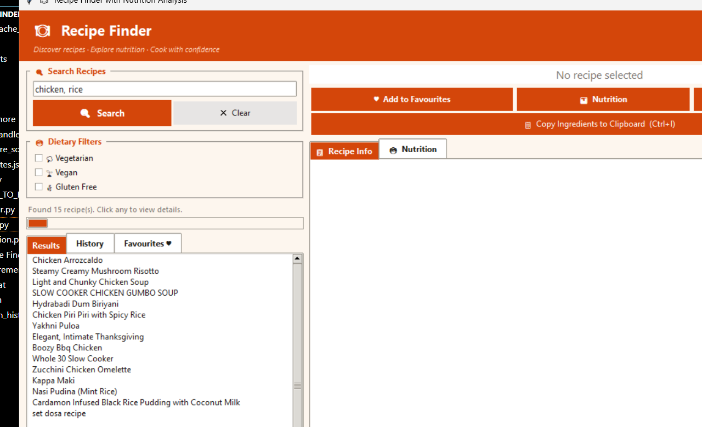
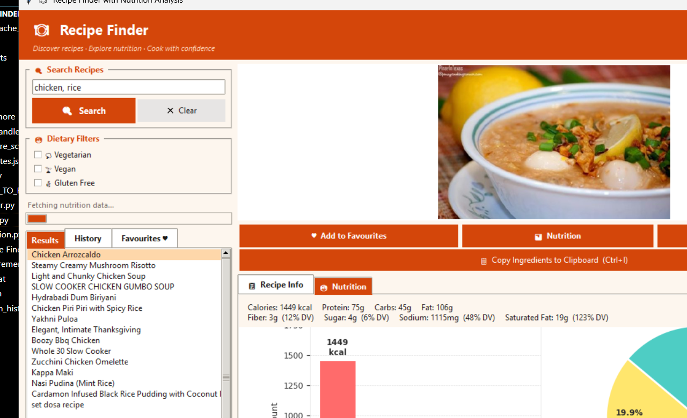
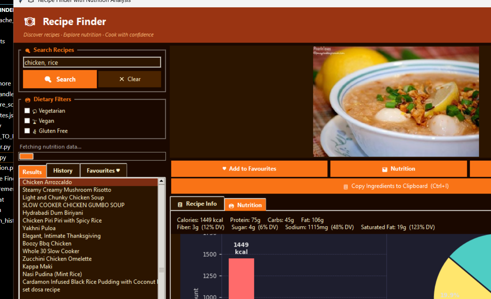

# 🍽️  Recipe Finder with Nutrition Analysis

  A Python desktop app that searches recipes by ingredients, shows full nutrition breakdowns, and lets you export recipes as PDFs — powered by the Spoonacular API.

  ---

  ## Features

  - **Ingredient-based search** — type any ingredients (e.g. `chicken, rice, tomato`) and get matching recipes
  - **Dietary filters** — filter by Vegetarian, Vegan, or Gluten Free
  - **Nutrition analysis** — bar and pie charts showing calories, protein, carbs, fat, vitamins
  - **Recipe details** — ingredients list, step-by-step instructions, cook time, servings
  - **Favorites** — save recipes for quick access later
  - **Search history** — revisit past searches with one click
  - **Export** — save any recipe as a **PDF** or nutrition data as **CSV**
  - **Dark mode** — toggle between light and dark themes
  - **Image caching** — recipe images cached locally for faster repeat views
  - **Offline-friendly errors** — clear messages for no internet, API limit reached, wrong key

  ---

  ## Screenshots

  | Search Results | Nutrition Chart | Dark Mode |
  |---|---|---|
  |  |  |  |

  ---

  ## Tech Stack

  | Library | Purpose |
  |---|---|
  | `tkinter` | GUI framework (built into Python) |
  | `Pillow` | Show recipe images in the window |
  | `pandas` | Organise nutrition data into tables |
  | `matplotlib` | Draw bar and pie charts |
  | `reportlab` | Export recipes as PDF files |
  | `requests` | HTTP calls to Spoonacular API |
  | `python-dotenv` | Load API key safely from `.env` file |

  ---

  ## Getting Started

  ### 1. Get a Free API Key

  1. Go to [spoonacular.com/food-api](https://spoonacular.com/food-api)
  2. Click **Start for Free** and create an account
  3. Go to **My Console → Profile** and copy your API key

  ### 2. Set Up the API Key

  Create a file named `.env` in the project folder and add:

  SPOONACULAR_API_KEY=your_api_key_here

  > Free plan gives **150 API calls/day** — no credit card needed.

  ### 3. Install Python

  Download from [python.org/downloads](https://www.python.org/downloads/)

  > **Windows:** Check the box **"Add Python to PATH"** during installation.
  > **Linux:** `sudo apt install python3 python3-pip python3-tk python3-venv`

  ### 4. Run the App

  **Windows** — double-click `run.bat`

  **Mac / Linux:**
  ```bash
  chmod +x run.sh
  bash run.sh

  The launcher automatically creates a virtual environment and installs all dependencies.

  Or run manually:
  pip install -r requirements.txt
  python main.py

  ---
  How to Use

  1. Type ingredients in the search box (e.g. chicken, rice, tomato)
  2. Optionally select a dietary filter
  3. Press Search or hit Enter
  4. Click any recipe in the results list
  5. Click Show Nutrition to see the calorie and macro chart
  6. Click Add to Favourites to save it
  7. Click Download PDF to export the recipe
  8. Click Dark Mode to switch themes

  ---
  Project Structure

  RecipeFinder/
  ├── main.py              # Entry point — dependency check + launch
  ├── gui.py               # All windows, buttons, and UI logic
  ├── api_handler.py       # Spoonacular API calls (search, info, nutrition, images)
  ├── nutrition.py         # Nutrition charts and data tables
  ├── logger.py            # Rotating file logger
  ├── requirements.txt     # Python dependencies
  ├── run.bat              # One-click launcher (Windows)
  ├── run.sh               # One-click launcher (Mac/Linux)
  ├── HOW_TO_RUN.txt       # Detailed setup guide
  └── .gitignore

  Auto-created at runtime (not in repo):
  venv/                    # Virtual environment
  logs/recipe_app.log      # Activity log (rotates at 1 MB)
  cache/                   # Downloaded recipe images
  exports/                 # Saved PDFs and CSVs
  search_history.json      # Past searches
  favorites.json           # Saved recipes

  ---
  Troubleshooting

  ┌───────────────────┬─────────────────────────────────────────────────────┐
  │      Problem      │                         Fix                         │
  ├───────────────────┼─────────────────────────────────────────────────────┤
  │ python not found  │ Install Python and check "Add to PATH"              │
  ├───────────────────┼─────────────────────────────────────────────────────┤
  │ tkinter not found │ Linux: sudo apt install python3-tk                  │
  ├───────────────────┼─────────────────────────────────────────────────────┤
  │ HTTP 401 error    │ API key is wrong — recheck your .env file           │
  ├───────────────────┼─────────────────────────────────────────────────────┤
  │ HTTP 402 error    │ Free daily limit (150 calls) reached — try tomorrow │
  ├───────────────────┼─────────────────────────────────────────────────────┤
  │ No results found  │ Try simpler ingredients like chicken or pasta       │
  ├───────────────────┼─────────────────────────────────────────────────────┤
  │ PDF saves as .txt │ Run pip install reportlab then try again            │
  ├───────────────────┼─────────────────────────────────────────────────────┤
  │ App crashed       │ Open logs/recipe_app.log for full error details     │
  └───────────────────┴─────────────────────────────────────────────────────┘

  ---
  License

  This project is for educational purposes. Recipe data provided by the Spoonacular API (https://spoonacular.com/food-api).

  ---
